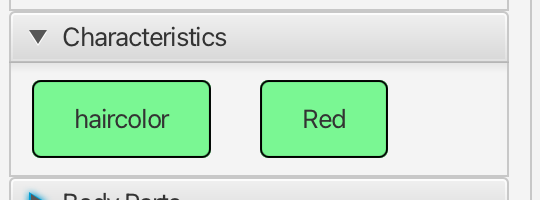
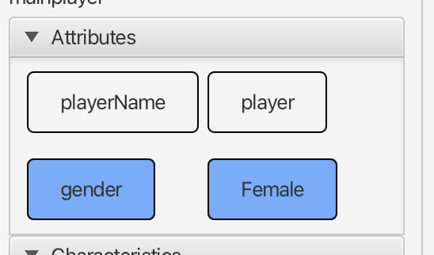

## Building an IDE for text adventure games

By this point, I have covered most of the core libraries used; now it is time to get into the core game building. The end product of my work was an IDE for making text adventure games. This IDE was intended to feel somewhat familiar to developers used to using an IDE.

## Building a UI Framework

The last core library I haven't covered to this point was IROShell. Looking back, I don't have many grievances about this software. However, I will say its shortcoming came from overengineering. I had built a Java UI framework on top of JavaFX that I intended to use going forward. The problem was that, after this project, all of the work I did was in the web ecosystem. So, I didn't get to use this again.

This framework required a mindset where users had complete control over the layout of multiple tabs. The result was layers of abstraction between you and the end layout. You would define views, menus, and toolbars. Then the framework would put them in their correct place and allow the user to move them further.

This framework also included features for different layout strategies, namely a multiple-document interface and a single-document interface. It also had the ability to define custom pre-load screens, such as a splash screen or a login screen.

Looking back, some of the biggest issues with this had been building on Java-core and Logrunner. While it was very helpful for me to generate logs, having your framework generate logs for debugging your application shell on an end user's machine was a bad idea in hindsight.

Also, while the feature was incredibly helpful, the execution of the dynamic styling feature was problematic. I had built a feature that allowed for dynamically changing the application's styles just by changing a CSS file. This would watch the file for changes and host an internal Java protocol for reapplying the styles. The problem was that this required a new protocol to be defined, and the protocol I chose was called `internal://`. In hindsight, that was a terrible and careless naming decision. It also required constantly creating new URLs, which likely led to memory leaks.

## Issues in the Core

The textadventurelib was the core of the game engine. This is where all the real game logic occurred, which just so happened to be turning an XML representation of some game state into a functioning game.

### In pursuit of clean code

To create the cleanest code I could think of, I ended up creating multiple cases of indirection that were hard to follow but also quite common in front-end development. One specific case that comes to mind is game state processing.

To set the stage, the general operation model broke down into the following

1. A game has game states
2. A game state has options
3. Options have triggers and actions.

In many cases, you would want to send a message from an action to the game state. However, since the game state was the holder of the action, you wouldn't want that action to interact with the game state; that isn't clean, right? How I addressed this created a different problem. The actions would call back on an interface that the game state had. The problem was to wire all of this up; the game state had to understand all possible actions to hook up any action that might call it back later. This created a problem where the game state had to infer the type of the action at startup time.

```
Startup
load game state --> iterate all options --> find actions --> if action of type x add listener y
```

```
Send event
action triggered --> find all listeners --> call specific interface callback
```

To make matters worse, the design of these actions was overkill. These actions allowed multiple callback handlers, but in practice, there would only ever be one.

This created ugly code like the following.

```java
for (IOption option : options) {
	if (option.action() instanceof CompletionAction) {
		CompletionAction act = (CompletionAction)option.action();
	    act.addListener(this);
	}
	if (option.action() instanceof AppendTextAction) {
		AppendTextAction action = (AppendTextAction)option.action();
	    action.addListener(this);
	}
	if (option.action() instanceof FinishAction) {
		FinishAction fAction = (FinishAction)option.action();
	    fAction.addFinishListener(this);
    }
}
```

Instead of creating this mess, I could have used a message broker pattern or provided all actions access to the game state.

### Just let people figure out images for themselves

This one is quick and minor, but early on, I decided it was very important that images be stretched to fit the image area, aspect ratio be dammed. In hindsight, this was clearly a silly choice.


### Maybe the entity model wasn't that good

So much of this code is a complicated mess. This mess was most noticeable when you needed to act on the data in an action or trigger. This complication originated from building mental models of real-world concepts in code. What I mean is that if I had simplified the player down to: a player is an entity that can have many properties, I could have saved a lot of complexity. The important distinction between that and what I build is the dimensionality. In this alternative, I would have had a flat list of properties. Mapping classes to the real-world abstraction created friction in actions, triggers, and macros. I had to build overly complex, loosely typed models just to allow you to modify or read the specific data you needed to act on. This resulted in more cases of `Object` instead of type, as well as some unnecessary reflection.

### Macro's needlessly complicated

Another feature that was important to me was macro substitution. If you have attribution on a player, you should show it in the game at some point. For this, I created a complex substitution pattern that was somewhere between a substitution engine and a DSL. Let's consider a player with the attribute age. To get the value, you would have to create this macro `{[player(PlayerName)@attribute(age)@value]}`. Since that wasn't complex enough, I decided to abstract out the separators so that it could be written in other ways. At execution time, this translated to dynamically building regular expressions and using reflection to find the properties on objects that you wanted to display.

Looking back, I think there are a couple of ways I could have done this differently. First, there is the recurring observation that the entity model was too complex. However, if I couldn't have done that, there are other options, such as creating a DSL or even maintaining a simple map of a unique identifier to a substitution value.

### Manual persistence code?

An overwhelming amount of code and classes were duplicated entities that had been defined for the sake of persisting with persistlib. A noticeable amount of the code written would simply not exist if metaprogramming were used to persist classes. There are ways to do this in Java, but even if I wanted to accomplish this with my own system, making persistlib metadata-driven using Java annotations would have saved a great deal of effort.

## Bringing it all together in an IDE

All of this work had built up to the text adventure creator. This was an IDE for generating text adventure games. It built on all of the prior libraries, plus some JavaScript ports I didn't mention. The mistakes of the existing libraries would resonate here, but there had been a few new ones.s

### Code generation is brittle

Originally, the end result asset was going to be either an XML file that could be provided to another application or a compiled jar. In the end, I instead supported all of these

* An XML-based file that could be provided to another application that did not exist.
* A generated jar.
* A generated Maven project for a developer to later generate a jar.
* A generated game in an HTML file format.
* A generated game as an electron app.

The choice to support all of these with no users was painful. To make matters worse, the HTML asset generation used a Webpack build system and React. When you are not actively working on a web project every day, you will find yourself in a legacy state that is hard to get out of. In modern web development libraries, build systems, and Node.js versions change at a nauseating pace. A failure to update every 6 months means you will feel incredibly behind if you wait two or more years to update something.

Another thing that made this quite painful was that I used very large format strings for all of this. Using a framework like Handlebars or having a template file with clear substitutions would have made this much easier when making changes to the generated assets. Here is one example of the crazy code I ended up writing instead of creating a sane template.

```java
public final static String GAMESTATEINITIALIZER = "package org.%s.%s;\r\n\r\n"
			+ "import ilusr.gamestatemanager.GameState;\r\n"
			+ "import ilusr.gamestatemanager.GameStateManager;\r\n"
			+ "import javafx.stage.Stage;\r\n"
			+ "import textadventurelib.persistence.TextAdventurePersistenceManager;\r\n\r\n"
			+ "public class GameStateInitializer {\r\n\r\n"
			+ "\tprivate Stage mainStage;\r\n"
			+ "\tprivate GameStateManager manager;\r\n\r\n"
			+ "\tpublic GameStateInitializer(Stage mainStage) {\r\n"
		    + "\t\tthis.mainStage = mainStage;\r\n\r\n"
		    + "\t\tinitialize();\r\n"
			+ "\t}\r\n\r\n"
		    + "\tprivate void initialize() {\r\n"
			+ "\t\tmanager = new <String>GameStateManager(\"NA\", new GameState(null));\r\n"
		    + "\t\tMainMenuGameState mainGameState = new MainMenuGameState(manager, mainStage);\r\n"
			+ "\t\tmanager.addGameState(GameStates.MAIN, mainGameState);\r\n"
		    + "\t\tmanager.addGameState(GameStates.TRANSITION, new TransitionGameState(mainStage, manager, buildPersistenceManager()));\r\n"
		    + "\t\tmanager.addGameState(GameStates.LOAD, new LoadGameState(manager, mainStage));\r\n"
		    + "\t\tmanager.currentGameState(mainGameState);\r\n"
	        + "\t}\r\n\r\n"
		    + "\tprivate TextAdventurePersistenceManager buildPersistenceManager() {\r\n"
	        + "\t\tTextAdventurePersistenceManager retVal = null;\r\n\r\n"
		    + "\t\ttry {\r\n"
			+ "\t\t\tretVal = new TextAdventurePersistenceManager(getClass().getResource(\"%s.xml\").toExternalForm());\r\n"
		    + "\t\t} catch (Exception e) {\r\n"
			+ "\t\t\te.printStackTrace();\r\n"
		    + "\t\t}\r\n\r\n"		
		    + "\t\treturn retVal;\r\n"
	        + "\t}\r\n\r\n"
	        + "\tpublic void run() {\r\n"
		    + "\t\tmanager.start();\r\n"
	        + "\t}\r\n"
            + "}";
```

Good luck trying to line up those %s substitutions!

### Player model strikes again

As we now know, a complex player model made player-specific triggers, actions, and macros hard. As it turns out, this resurfaces when you are building a UI for those actions, triggers, and macros. For a decent user experience, you don't want to keep a user guessing. For example, if you want to create a trigger that fires every time a player's health is below 10, you would want the UI to help you. The player model knows what attributes the player has, their types, and even their default value. To accomplish this, I built a complex set of dynamic combo boxes, or selects if you prefer that terminology. These would be dynamically added or removed based on the combo box prior, and their values would be tied to the entity model.

Despite getting this to work functionally, the UX was still clunky.

### I am not a designer

As evidenced by the beautiful artwork below, I am not a designer and probably will never be great at it.


As a result, my style choices came off looking crude and childish. Since it was not my core focus, I didn't spend much time refining it. This often appeared as unstyled UI, but in other cases, it was just styled poorly. A prime example of this is the debugging experience I built into the IDE. While I found it useful to a degree, the debugger looked terrible. It also lacked the functionality you might expect from a debugger. The result was a poorly styled entity state tracker. Every time an action was triggered that changed a player's state, you would see removed entities in red, updated entities in blue, and added entities in green. The problem was that these had been styled so big and bulky that it was hard to read the change.

Example of this visualization




While this primative debugger was helpful for me, doubling down on making this better instead of focusing on other features would have been to my benefit.

### Feature bloat gets in the way of deep work

Constantly going wide on this means having to support questionable value work without improving the core experience. This often leads to making UI changes just to support a new feature that provides little value. One example where this surfaced in this project was in the initial game creation wizard. Over time, something simple grew into a three-page wizard that was constantly changing. To make matters worse, most of the options provided little value. Every time I wanted to run another test, it added unnecessary time to just create a test game.

Had I focused on the core problem, I could have spent more time making the experience better and wasted less time on UIs that reflected the ever-changing options.

### Dynamic styling was very helpful

The investment in being able to dynamically style IROShell came in very handy. While developers who have only worked on Web 2.0 likely won't understand, having to wait for an entire compile of a Java application just to test one CSS change was miserable. Investing the time into that saved me a ton of recompile time.

## High-level lessons learned

**Prototypes are valuable!** Believe it or not, you are allowed to write crappy or unclean code to learn what does and doesn't work in a system. Spending too much time making something clean can distract from understanding the core problem.

**Iteration time is everything!** I think this is part of why the web is doing so well. The time it takes to iterate on HTML, JS, and CSS assets is faster than that of a typical compiled application. If you disagree with this, focus on your toolchain. You don't actually need a build system for the web, and your iteration time is just a save and refresh away.

**If you are hand-writing persistence code for each entity, you are probably doing something wrong!**

**Each feature comes at a maintenance cost!** Without careful selection of features, you will end up with so much bloat that you cannot move forward. In all likelihood, most of those features don't matter anyway. Treat your features like cattle, not pets!