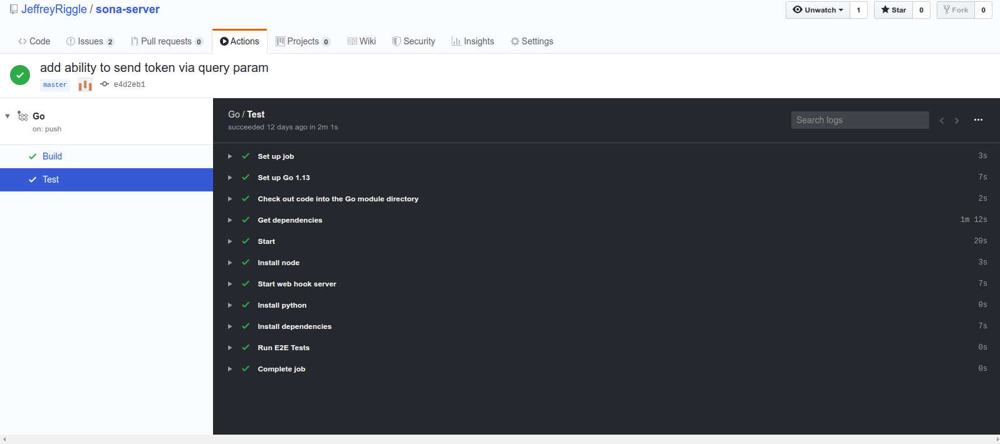
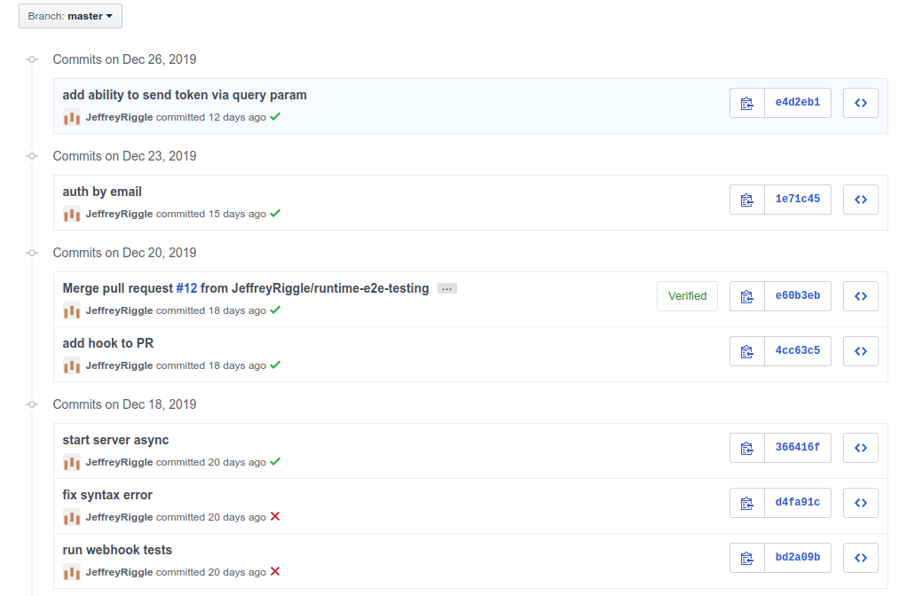

# Getting into it
Recently I had decided I wanted to start creating a CI/CD (Continuous Integration / Continuous Delivery) pipeline for some of the code I have up on Github. I have dealt with CI/CD in the past and generally have enjoyed the consistent feedback loop on the changes I push. One thing I did want with this CI was some kind of feedback loop in Github to show the current state of the project (failing, passing, etc).

Normally in these cases, I would reach for [Jenkins](https://jenkins.io/), but I tend to like to try something different when I am working on non-work related projects. Looking around the big competitors I noticed had been [Travis](https://travis-ci.org/) and [Circle](https://circleci.com/). However, I had heard of [Github Actions](https://github.com/features/actions) and that sounded like a perfect fit for what I wanted to do.

It just so happened that the public release of Github's actions timed very well with me wanting to create some CI/CD for my projects.

# Enter Github actions
Recently Github released [Github Actions](https://github.com/features/actions) to the general public. Github actions is a CI/CD system for code hosted on Github. Actions can be added to any Github project by creating a [YAML](https://yaml.org/) file in .github/workflows.

In a workflow there are a couple of important properties to know about.

 - name: The name property gives the workflow a name.
 - on: This can be one of a couple of different values. This is the trigger condition, when can this action be automatically executed. For me, the most valuable actions are triggered on `push` or `pull_request` but there are plenty of other triggers listed [here](https://help.github.com/en/actions/automating-your-workflow-with-github-actions/events-that-trigger-workflows).
 - jobs: This is the key to the workflow. A workflow has at least 1 job and a job is the main body of work to be done in a workflow.
    - runs-on: Controls what the job runs on. So far I have only had to use `ubuntu-latest`, but Windows and Mac OS's are supported. For more information see this [page](https://help.github.com/en/actions/automating-your-workflow-with-github-actions/workflow-syntax-for-github-actions#jobsjob_idruns-on).
    - steps: These are the individual actions that a job will take.
    - run: This is the script that will run in the step. In the case of ubuntu, this should be a bash script.

Simple example workflow
```yml
name: My CI
on: [push, pull_request]
jobs:
    greet:
        name: Greet
        runs-on: ubuntu-latest
        steps:
            - name: Greet
              run: echo 'Hello world'
```

# Putting actions to use
After a bit of research, I started getting to work on creating a CI pipeline for one of my [go](https://golang.org/) based projects.

In this process, I created two jobs a build job and an integration test job. In the build job, a couple of things had been done.

1. Install go on the ubuntu image.
2. Checkout related go code from Github.
3. Install dependencies for go code.
4. Build the go application.
5. Run the unit tests.

In the integration test job, a couple more things would be done.

1. Install go on the ubuntu image.
2. Checkout related go code from Github
3. Install dependencies and start the go application.
4. Install NodeJS
5. Build and start a simple web application. This was used to test Webhooks with my go application.
6. Install python 2.
7. Run integration tests that were written in python to test the go server.

The end result for all of this is the following yml file.
```yml
name: Go
on: [push, pull_request]
jobs:

  build:
    name: Build
    runs-on: ubuntu-latest
    steps:

    - name: Set up Go 1.13
      uses: actions/setup-go@v1
      with:
        go-version: 1.13
      id: go

    - name: Check out code into the Go module directory
      uses: actions/checkout@v1

    - name: Get dependencies
      run: |
        go get -v -d -t ./...
        if [ -f Gopkg.toml ]; then
            curl https://raw.githubusercontent.com/golang/dep/master/install.sh | sh
            dep ensure
        fi
    - name: Build
      run: go build -v .
      working-directory: ./src

    - name: Test
      run: go test
      working-directory: ./src

  Test:
    runs-on: ubuntu-latest
    steps:

      - name: Set up Go 1.13
        uses: actions/setup-go@v1
        with:
          go-version: 1.13
        id: go

      - name: Check out code into the Go module directory
        uses: actions/checkout@v1

      - name: Get dependencies
        run: |
          go get -v -d -t ./...
          if [ -f Gopkg.toml ]; then
              curl https://raw.githubusercontent.com/golang/dep/master/install.sh | sh
              dep ensure
          fi
      - name: Start
        run: |
          go build -v .  
          ./src ../test/RuntimeConfig.json &
        working-directory: ./src
    
      - name: Install node
        uses: actions/setup-node@v1
        with:
          node-version: '10.x'

      - name: Start web hook server
        run: |
          npm install
          npm run start &
        working-directory: ./test/webhooktester
          
      - name: Install python
        uses: actions/setup-python@v1
        with:
          python-version: '2.x'
      
      - name: Install dependencies
        run: |
          pip install requests
          pip install assertpy
      
      - name: Run E2E Tests
        run: python apitest.py
        working-directory: ./test
```

# UI
Run output


Commit feedback


# Final thoughts

Github actions are really easy to get up and running. All you have to do is add a yml file to your source control and you are up and running. There is no concern around managing infrastructure like you would have to do with Jenkins.

One big difference that I was worried about was the loss of a scripting language in my pipeline. Again I am used to Jenkins in which I could define my workflow and have the power of [groovy](http://groovy-lang.org/). At no point did I really feel limited by only being able to execute bash scripts.

It is also incredibly nice to have a decent UI to show my Job status as well as immediate feedback on my commit or PR around CI status.