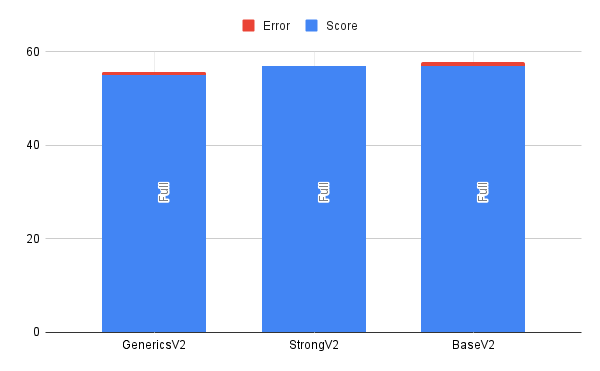
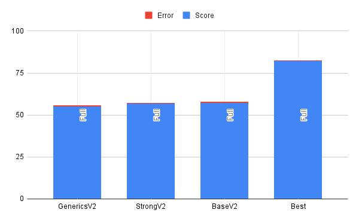
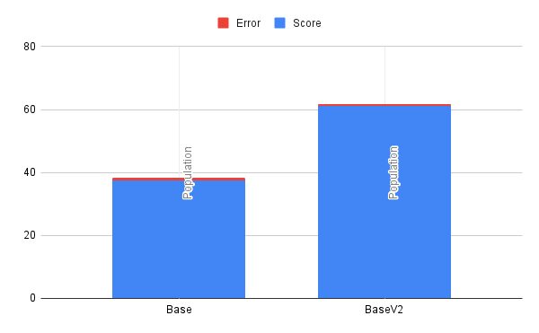
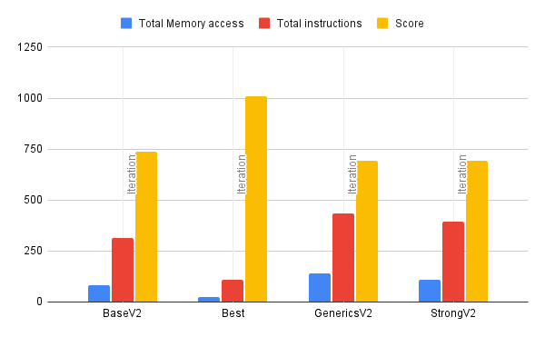
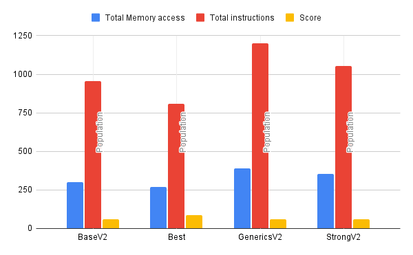

## Some ideas won't leave you alone

As I was publishing the last series of blogs, I had a constant nagging feeling that I left the biggest pain point underexplored. In the blog, I often lament the decision I made to support multiple attributes with dynamic values. At some point, I even suggested an approach to make the code more maintainable. While I enjoy the developer ergonomics of the solution, the thing I couldn't let go of was, "What is the cost of this abstraction?"

In general, I find this to be an undervalued consideration that can lead to designs that have questionable performance characteristics. The common argument is that the developer velocity makes up for it. In many cases, that is a reasonable tradeoff. However, doing a postmortem on a project that is unused gives me the flexibility to be as unreasonable as I want and stretch the limits.

## Setting up the experiment

In this experiment, I wanted to test the cases discussed in the blog.

### Original implementation (Base Case)

While this is not the exact same implementation of the original code the project was using, this is very close to what it would have been doing. The important thing to note is that the value is just stored as an Object. There isno help for the consumer to know what the underlying value is.

```Java
class Attribute {
    private String name;
    private Object value;

    public Attribute(String name, Object value)
    {
        this.name = name;
        this.value = value;
    }

    public Object getValue() {
        return this.value;
    }
}
```

### Implemented solution (Generics Case)

As mentioned in the blog, the solution that is currently in the project is based on generics. This case is intended to mimic the implemented case, but with a data type field. This allows for slightly better handling on the consumer side, but still requires the primitive to be stored as an Object.

```Java
class GenericCaseAttribute {
    private String name;
    private Object value;
    private DataType dataType;

    public GenericCaseAttribute(String name, Object value, DataType dataType)
    {
        this.name = name;
        this.value = value;
        this.dataType = dataType;
    }

    public <T> T getValue() {
        return (T) this.value;
    }

    public DataType getDataType() {
        return dataType;
    }
}
```

### Suggested solution (Strong Case)

This is the suggestion I made in the recent blog post that was never implemented. The important thing to note here is that Object is now gone and replaced with a strongly typed primitive.

```Java
abstract class StrongCaseAttributeBase {
    private String name;
    private DataType dataType;

    public StrongCaseAttributeBase(String name, DataType dataType) {
        this.name = name;
        this.dataType = dataType;
    }

    public DataType getDataType() {
        return dataType;
    }
}

class StrongCaseInt extends StrongCaseAttributeBase {
    private int value;

    public StrongCaseInt(String name, int value) {
        super(name, DataType.Integer);
        this.value = value;
    }
    public int getValue() {
        return this.value;
    }
}
```

### Optimal Solution (Best case)

In this case, I just did the solution I assumed would be the fastest. This breaks the requirements in an attempt to speed up the algorithm. This does not allow for multiple types and forces every value to be a double.

```Java
class BestCaseAttribute {
    private String name;
    private double value;

    public BestCaseAttribute(String name, double value)
    {
        this.name = name;
        this.value = value;
    }

    public double getValue() {
        return this.value;
    }
}
``` 

## The testing methodology

Now that I knew the implementations I wanted to test, I needed to set up a way to test the implementations. I settled on testing three different paths through the implementations. The first would be a full test that would build a list of 1,000,000 entities in the related data structure. I called this the population test. The second test would start with the population, but then iterate over all the values. However, only the iteration was measured. That test was referred to as the iteration test. Lastly, a full test would be done. This combined the population and iteration cases in what I call the full test.

## Finding the benchmark

Originally, I thought I could do a basic stopwatch test. In this case, I would grab the time, run the test, and then compute the delta to get the time the implementation took. Simple enough, right?

```Java
public static void main(String args[]) {
    long startTime = System.nanoTime();
    // Test here
    long endTime = System.nanoTime();
    System.out.println("Test took " + (endTime - startTime).toString());
}
```

Upon some reflection, I knew this was insufficient. The problem with timing Java is that it is a JIT-compiled language and as such it requires multiple passes over code before it’s optimized. If I really wanted a good representation of the real impact, I needed to do something better. As it turns out, people have spent a lot more time thinking about this than I have. There is an entire tool [JMH](https://github.com/openjdk/jmh) built for doing this type of test. Armed with a new tool, I decided to go with a pretty barebones setup in which I would test operations per second. As I mentioned, many benchmarks had to be created.

### Full run benchmark
```Java
@Benchmark
public void bestCase() {
    BestCase c = new BestCase();
    c.populate(1000000, 4);
    c.aggregateTotal();
}
```

### Population benchmark
```Java
@Benchmark
public void bestCase() {
    BestCase c = new BestCase();
    c.populate(1000000, 4);
}
```

### Iteration benchmark
```Java
@State(Scope.Benchmark)
private static BestCase c = new BestCase();

@Setup
public void setup() {
    c.populate(1_000_000, 4);
}

public class MyBenchmark {
    @Benchmark
    public void bestCase() {
        c.aggregateTotal();
    }
}
```

## Looking at the results

After spending more time than I care to admit running all of these tests, I ended up with a [dataset](./benchmarks.csv) I could play around with. If you filter out the V2 data points, you will notice something shocking. The best case doesn't just beat the other cases; it completely demolishes them. See, there is one thing I didn't mention. In the best case, I actually use a plain `Attribute[]` data type instead of an `ArrayList<Attribute>`, which has a huge implication. I will come back to this, but I made a minor change and generated some V2 benchmarks that lined the values up better.

### Impact of different approaches
Considering all of the originally considered approaches, we can see that the difference between them is more or less within the margin of error.


### Best case consideration
Much like I assumed, the best case outperformed the other cases, and it did so by a pretty noticeable amount.


## So wait, what was the big difference between V1 and V2?

I am so glad you asked. In the first version, all implementations except the base case used an unsized ArrayList. Now, some of you may know where this is going. It turns out that if you don't pre-size your ArrayList and grow it on insert, you pay a real performance cost. In this case, I insert 1,000,000 values sequentially, growing the ArrayList in the most inefficient way. As it turns out, the base size of an ArrayList in Java is [10 entries](https://github.com/openjdk/jdk/blob/5152fdcd490412025ba5f608378982abc1eadc07/src/java.base/share/classes/java/util/ArrayList.java#L119), and when you exceed the boundary, it [grows by 1.4x](https://github.com/openjdk/jdk/blob/5152fdcd490412025ba5f608378982abc1eadc07/src/java.base/share/classes/java/util/ArrayList.java#L237). This means in the end my arrays were resized nearly 30 times and produced an excess of 250k entries. This adds up to an insane amount of time, as the resizing event requires array copying and is a costly operation.



## But why stop there?

Now I could stop there, but where is the fun in that? At this point, I knew approximately the time it required, but I noticed that I was getting variability in my test runs with JHM. While it does provide direction, it is not the end source of truth. The question I had was, “How can you get closer to the source of truth?“ I decided the best way to find out what is going on is to see the actual disassembly generated by the JVM and interpret that.

### Getting the tools

This required a fair amount of setup. First, to reason about the assembly generated, I set up IntelliJ IDEA with [Jitwatch4j](https://plugins.jetbrains.com/plugin/25979-jitwatch4i/home). Since the benchmarking was run as a jar, I had to ensure the run generated a HotSpot log file. These log files contain all of the disassembly. To do this, I ran some crazy command like this.

```shell
$ java \
  -XX:+UnlockDiagnosticVMOptions \
  -XX:+PrintAssembly \
  -XX:+LogCompilation \
  -jar target/benchmarks.jar
```

Once I had the log files, I could then load them into Jitwatch4j and look at the disassembly. However, I still wasn't finding everything I wanted to see. As it turns out, some instructions are predefined in the JVM. The result is that the disassembly might just jump to some instruction you cannot see. After some searching, I found [hsdis](https://chriswhocodes.com/hsdis/) which gave me everything I was looking for.

### Looking at the disassembly

Now that I had the disassembly, it was time to find anything interesting in there. The first challenge I had to overcome was learning the ARM architecture. In the past, the only assembly I had done was based on the x86 architecture, and ARM was a learning curve for me. After spending a while figuring out how to read the [manual](https://developer.arm.com/documentation/ddi0487/latest/) and using [this cheat sheet](https://www.scs.stanford.edu/~zyedidia/arm64/), I was able to piece together some basics.

I had understood that there was a cost in some languages when storing as an object and casting it back to a primitive. What I found interesting in the disassembly is that it does not appear to be the case. Instead, we just find the underlying data, put it in a register, and add it.

Let's consider this Java source.
```Java
public double aggregateTotal() {
        double retVal = 0;

        for (GenericCaseAttribute attr : this.data) {
            double value = 0;
            switch (attr.getDataType()) {
                case Double:
                    value = (double)attr.getValue();
                    break;
                case Integer:
                    value = (double)(int)attr.getValue();
            }
            retVal += value;
        }

        return retVal;
    }
```

When the double branch is hit, we do a straight-forward addition.
```assembly
0x0000000115a623e4: ldr d16, [x0,  #16] ; Get field containing double value and store in d16
0x0000000115a623e8: b 0x0000000115a62400
; intermediate steps truncated
0x0000000115a62400: add w17, w10  #0x1 ; Increment ArrayList iterator
0x0000000115a62404: fadd d0, d0, d16  ; Add double attribute value d16 to retVal d0 and store in d0  
```

However, converting an integer double is not free and requires an extra operation.
```assembly
0x0000000115a62470: ldr w10, [x0,  #12] ; Get field containing int value and store in w10
0x0000000115a62474: scvtf d16, w10  ; convert int value in w10 to double value in d16
0x0000000115a62478: add w10, w17  #0x1 ; Increment ArrayList iterator
0x0000000115a6247c: fadd d0, d0, d16  ; Add double value in d16 to retVal d0 and store in d0
```

What I noticed was that in both cases, there hadn't been special instructions to go from Object to double or Object to int.

### Finding metrics to pull from the disassembly

After spending time inspecting the disassembly, I realized it was hard to find significant findings. Looking at 800+ lines of assembly and comparing them to another 800+ lines where there is an illegible diff just wasn't cutting it. At that point, I remembered something: the slowest operations on the CPU should be memory access, especially. These are even more pronounced if memory access misses the L1 cache. In the disassembly of this program, most operations outside of memory access should have fairly low time complexity. All operations had been very simple arithmetic. Things like sin, cos, or even division didn't show up.

With this new insight, I decided to count all of the memory access operations for each case and plot them in this [dataset](./asmmetrics.csv).

## Correlation between data sets

I realize that just the number of memory access operations or the number of lines of assembly code is a flawed metric for determining performance. This is because you don't actually know how the branches will be used at runtime. However, I found it to be shockingly correlated to the timing dataset from JHM. Basically, the more memory access operations you have defined in the routine, the fewer operations you can do per second.

**Correlation between memory access and operations in iteration runs**



**Correlation between memory access and operations in population runs**



## Leasons learned

Depending on where you are willing to set your limit, Java performance evaluations can go much deeper than many people may realize. From intuition to slow path to a JIT-compiled path, there are many opportunities for performance to be difficult to measure. This whole test didn't even consider the differences between hotspot optimizations for different CPU architectures, which could have been explored.

However, if the numbers tell you one thing, it is to pay close attention to your collections and how you initialize them. Failure to do so will result in a serious decrease in performance.

In this case, it turns out that the costs I cared about for legibility weren’t the ones the machine cared about.