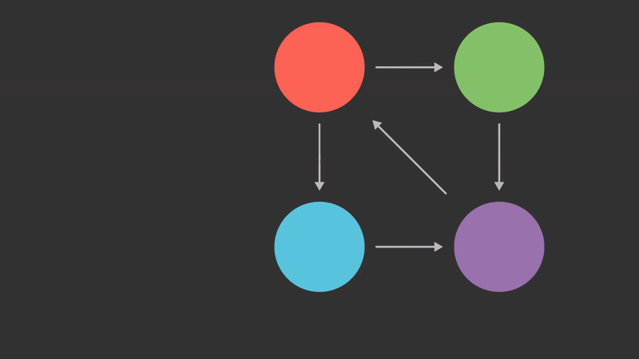

# Figuring out what is important

By now, we have built a functioning web crawler and even generated some administrative tooling to make crawling easier. Now the problem is we don't really know what data is important. This is not a new problem, and research has been conducted on this. The most notable research in this field would be [Bringing Order to the Web](http://ilpubs.stanford.edu:8090/422/1/1999-66.pdf). In this paper, the concept of a page ranking system was proposed. This is where my curiosity took me next, so I began to fumble through figuring it out.

## A brief aside

This is the part where I am glad I am writing a series of blog posts despite the fact that I will likely be the only one to read them. Going into this blog entry, I assumed I had taken notes on implementing page rank. I also assumed I had implemented it correctly. Over the past few days, I found that I was very wrong on this, and I only found that out because I wanted to create this entry.

## Bringing Order to the Web

Back in 1998, Sergey Brin and Larry Page wrote a paper on how to address this issue. Why I didn't read this on my first attempt to implement, I have no idea. This paper not only explains how to determine which pages are important, but it also covers some of the challenges of crawling the web, many of which I encountered. In this paper, they discuss how to approach the problem and elaborate on some applications of the algorithm in two different search engines.

The key insight behind the PageRank algorithm is that any given pages importance can be derived from the importance of all page's that link to it. 

### The difficulty with links

The primary focus of the algorithm is on so-called backlinks. The problem with backlinks is that it's impossible to know if you have all the backlinks to a page. Instead, you can only tell the forward links for a page. If you could effectively gather every page, then you could produce a proper graph with the correct backlinks. However, since the content on the internet is constantly changing, you can only ever work on a partial subset of the internet. Because of this, certain considerations had been made that could make the algorithm more effective.

### The algorithm

I will spare you the formal notation of the algorithm; if you are interested in that, I suggest you read the paper. Let's walk through the algorithm. The first step is to build an adjacency matrix of all pages and their edges. In this paper, they suggested building an N by N matrix where all values are either 0 or 1. This bit would correlate to the existence of an edge. Also, in this matrix, the N value is all of the known pages on the internet. After this is done, we need to normalize the matrix such that each page is sending an equal weight to all of its links. Once this is done, we generate a random vector of size N as our starting point. We then repeatedly multiply the vector by the normalized adjacency matrix until it converges.


The property of convergence comes from the fact that this is an eigenvector problem. If you are more interested in the mathematics of this problem, I suggest reading more about [eigenvectors](https://en.wikipedia.org/wiki/Eigenvalues_and_eigenvectors) and [Markov chains](https://en.wikipedia.org/wiki/Markov_chain).

### Additional considerations

This paper explores additional considerations for this algorithm. The most notable ones are dangling references and the personalization vector.

#### Dangling references

One problem with this algorithm appears when a page has no outbound links. In this case, the page ends up being a bit of a rank sink. Generally, when this happens, it's not because the page doesn't link to anything, but rather that the page has not been processed yet. To manage this, the suggestion is to remove dangling references from the original calculation and then add them back in later with some initial value.

#### Personalization Vector

Another issue with search is contextualization. The example given in this paper is someone searching for "wolverine". The additional context here is that wolverine is or maybe was an administrative tool used by students at Michigan University. When the typical person searches for wolverine, they would expect to find more details about the animal. However, when a student at Michigan University does the same search, they might be interested in the tool. The suggestion proposed in this paper is that we could create personalization vectors that get added to the equation to make one of the search contexts more likely for the given person.

## Looking at an example

Now that I have covered the algorithm, I find it's best to see it applied on a smaller scale. Below is an animation that shows how a small internet with 4 pages and 5 links would propagate rank. This only shows one transformation, and many more of the same operation would happen in practice.



## Examining some implementations

I also find it helpful to see how others have implemented the solution. The following are a couple of implementations publicly shared on Github that I used to better understand how others have implemented this algorithm.

### Memgraph

[Memgraph](https://memgraph.com/) is a graph-based database written in C++. It is common for graph databases to provide functionality like PageRank out of the box because it is a clear graph algorithm. While I will not cover its implementation, another popular graph database that provides this functionality would be [Neo4j](https://neo4j.com/).

The majority of the interesting parts of the code can be found [here](https://github.com/memgraph/mage/blob/main/cpp/pagerank_module/algorithm/pagerank.cpp). In this implementation, a few optimizations are added to the original algorithm. The first optimization is building a coordinate list instead of a square matrix of all nodes. So instead of having a data structure like this
```javascript
[
    [0, 1, 0, 0],
    [1, 0, 0, 0],
    [1, 1, 0, 0],
    [0, 0, 1, 0]
]
```

we could instead have this
```javascript
[[0, 1], [1, 0], [2, 0], [2, 1], [3, 2]]
```

The second optimization that was applied was the use of parallel execution. In the Memgraph implementation, each cycle of the vector by matrix multiplication step is broken up amongst the cores available for execution. Meaning the multiplication is split into batches. Those batches are executed in parallel and then finally merged back together in a final pass.

### NetworkX

[NetworkX](https://networkx.org/documentation/stable/index.html) is a Python library for handling network-related algorithms. This appears to align a bit more with the academic side of this topic. The implementation of the algorithm can be found [here](https://github.com/networkx/networkx/blob/main/networkx/algorithms/link_analysis/pagerank_alg.py). This algorithm can run on [SciPy](https://scipy.org/) or [NumPy](https://numpy.org/). My research mainly focused on the SciPy implementation. For the most part, this was very similar to the Memgraph implementation with some notable differences. One of the differences was that there was no explicit multithreading. All operations were done using matrix operations on SciPy classes. Since I have not investigated how SciPy handles aspects like the `@` operator, it is entirely possible that under the covers, these matrix operations happen in parallel.

One thing I found interesting was how true to the paper this algorithm was in how it was expressed. It worked on matrix multiplication of adjacency graphs. The bulk of the operation can be summed up in this line of Python.

```python
x = alpha * (x @ A + sum(x[is_dangling]) * dangling_weights) + (1 - alpha) * p
```

In this case, A is the adjacency matrix, but it is actually a coordinate graph in its storage. We will also notice that in this implementation, dangling nodes are handled, and they introduce the personalization vector `p`.

## Trying it out myself

Even though modern search engines have moved far beyond just using a page rank algorithm, it was a lot of fun for me to explore this. This was one of a few times when I actually got to read a white paper. Since so much of this for me had been for learning, I actually created my own implementation of PageRank. My goal was not to be efficient but to fully understand it, so I even hand-rolled the matrix multiplication logic. I have been timing my implementation, and at the current scale I am testing with, the bottleneck is certainly the time to crawl all pages. Also, in my implementation, I do a crazy inefficient scan of pages to build the initial adjaceny matrix. I suspect I will optimize that as needed instead of reaching for one of these libraries to do the trick.

By now, we have covered basically all of the back-end processing and collection I planned on covering. Going forward, I will take some time to talk about some of the searching UI's and visualizations I put on top of this data.
