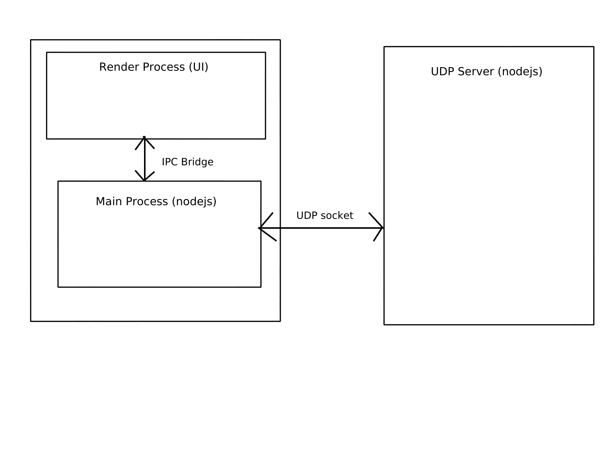
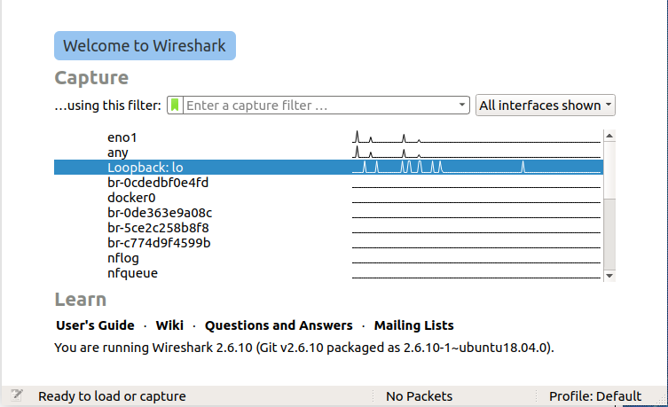

# UDP Transport
This is the first in the transport layer series. In this blog we will look into the User Datagram Protocol or UDP for short. UDP is part of the Internet Protocol (IP) suite and resides in the application layer. UDP is an unreliable protocol, that is not to say it is bad it just does not guarantee packet delivery like some other protocols.

### Reviewing the network protocol
UDP is made up of 5 parts: Source Port, Destination Port, Length, Checksum and data octets.

#### Source Port
The source port is an optional field. This field indicates the port that the sending process is using to communicate.

#### Destination Port
This is the port has a meaning within the context of a particular internet destination address.

#### Length
Length is the number in octets of the user datagram including the header and the data. The minimum possible value for length is 8.

#### Checksum
The checksum is the 16-bit one's complement of the ones complement sum of a psuedo header using the IP header, the UDP header and the data. This is padded with zero octets and the end to make a multiple of two octets.

Example

Source IP address: 192.168.0.15
Destination IP address: 192.168.0.23
Source Port: 35
Destination Port: 40
Length: 10
Message: Hi

| value | Decimal | Binary | Hex |
| - | - | - | - |
| Source IP | 192.168   0.15 | 1100 0000 1010 1000   0000 0000 0000 1111 | C0 A8   00 0F |
| Destination IP | 192.168   0.23 | 1100 0000 1010 1000   0000 0000 0001 0111 | C0 A8   00 17 |
| Reserved/UDP | 0/17 | 0000 0000 0001 0001 | 00 11 |
| Padding | 0/10 | 0000 0000 0000 1010 | 00 0A |
| Source Port | 35 | 0000 0000 0010 0011 | 00 23 |
| Destination Port | 40 | 0000 0000 0010 1000 | 00 28 |
| Length | 10 | 0000 0000 0000 1010 | 00 0A |
| Data | Hi | 0100 1000 0110 1001 | 48 69 |
 

| Add up all numbers to generate psudo header |
| - |
| 1100 0000 1010 1000 |
| + |
| 0000 0000 0000 1111 |
| + |
| 1100 0000 1010 1000 |
| + |
| 0000 0000 0001 0111 |
| + |
| 0000 0000 0001 0001 |
| + |
| 0000 0000 0000 1010 |
| + |
| 0000 0000 0010 0011 |
| + |
| 0000 0000 0010 1000 |
| + |
| 0000 0000 0000 1010 |
| + |
| 0100 1000 0110 1001 |
| = |
| 1 1100 1010 0110 1111 |
 

| Since this number overflows split into two 16bit address spaces and add |
| - |
| 0000 0000 0000 0001 |
| + |
| 1100 1010 0110 1111 |
| = |
| 1100 1010 0111 0000 |

Take ones compliment to get checksum value.
 
**0011 0101 1000 1111**

#### Data Octets
The actual data you want to send in the packet.

| field | bit range |
|-|-|
| Source Port | 0-15 |
| Destination Port | 16-31 |
| Length | 32-47 |
| Checksum | 48-63 |
| Data octets | remaning |

https://tools.ietf.org/html/rfc768

### Building an example of the protocol

### Example of a standard library
* nodejs - https://nodejs.org/api/dgram.html
* Java - https://docs.oracle.com/javase/7/docs/api/java/net/DatagramSocket.html
* Go - https://golang.org/pkg/net/
* Python - https://docs.python.org/3/library/socket.html
* Rust - https://doc.rust-lang.org/std/net/struct.UdpSocket.html

### Example of a client server application using the protocol
https://github.com/JeffreyRiggle/udp-example-app

The following github page shows a simple example of a udp based client-server. In this example we have a UDP server that listens on port 4000. 

The client in this case is an electron based application. In order to reduce complexity the UI does not use any modern framework and just interacts directly with the DOM API.

Overview of the architecture

For now to show that UDP does not enforce any structure on the payload the messages sent to the server use a binary like structure. However the response from the UDP server is in JSON and can be parsed.

### Look at the results in a network capture
To take a look at how this application works at the network layer [wireshark](https://www.wireshark.org/) will be used. This application can be rather easily installed on most operating systems.

Once wireshark is installed a capture of network traffic can be issued. Since I am running this on my local machine I need to capture network on my loopback interface.

Now that the capture is running using the very simple example application we should be able to see UDP traffic flowing from the electron application to the UDP server.

| Seq | Info | packet |
|-|-|-| 
| 1 | Request existing messages | 0000   00 00 00 00 00 00 00 00 00 00 00 00 08 00 45 00   ....... .......E. 0010   00 1d 5a 29 40 00 40 11 e2 a4 7f 00 00 01 7f 00   ..Z)@.@.â¤...... 0020   00 01 e3 77 0f a0 00 09 fe 1c 01                  ..ãw. ..þ.. |
| 2 | Respond with existing | 0000   00 00 00 00 00 00 00 00 00 00 00 00 08 00 45 00   ........... ...E. 0010   00 34 5a 2a 40 00 40 11 e2 8c 7f 00 00 01 7f 00   .4Z*@.@.â....... 0020   00 01 0f a0 e3 77 00 20 fe 33 7b 22 69 74 65 6d   ... ãw. þ3{"item 0030   73 22 3a 5b 5d 2c 22 73 65 67 6d 65 6e 74 22 3a   s":[],"segment": 0040   30 7d                                             0} |
| 3 | Send new message | 0000   00 00 00 00 00 00 00 00 00 00 00 00 08 00 45 00   ..............E. 0010   00 29 5a c0 40 00 40 11 e2 01 7f 00 00 01 7f 00   .)ZÀ@.@.â....... 0020   00 01 e3 77 0f a0 00 15 fe 28 02 48 65 6c 6c 6f   ..ãw. ..þ(.Hello 0030   20 57 6f 72 6c 64 21                               World! |
| 4 | Ack message | 0000   00 00 00 00 00 00 00 00 00 00 00 00 08 00 45 00   ..............E. 0010   00 63 5a c1 40 00 40 11 e1 c6 7f 00 00 01 7f 00   .cZÁ@.@.áÆ...... 0020   00 01 0f a0 e3 77 00 4f fe 62 7b 22 69 74 65 6d   ... ãw.Oþb{"item 0030   73 22 3a 5b 7b 22 74 69 6d 65 22 3a 31 35 39 31   s":[{"time":1591 0040   30 30 39 32 36 37 32 39 33 2c 22 6d 65 73 73 61   009267293,"messa 0050   67 65 22 3a 22 48 65 6c 6c 6f 20 57 6f 72 6c 64   ge":"Hello World 0060   21 22 7d 5d 2c 22 73 65 67 6d 65 6e 74 22 3a 31   !"}],"segment":1 0070   7d                                                } |

Looking at these messages you will notice that all messages going to the server are buffers and all messages coming from the server are buffers containing JSON based strings. As mentioned earlier this was done to show that UDP does not enforce structure on message content.

To better understand what is going on here lets take a closer look at sequence packets 3 and 4.

In packet 3 the client (electron application) is sending a new message to the server.
0000   00 00 00 00 00 00 00 00 00 00 00 00 08 00 45 00 
0010   00 29 5a c0 40 00 40 11 e2 01 7f 00 00 01 7f 00 
0020   00 01 e3 77 0f a0 00 15 fe 28 02 48 65 6c 6c 6f 
0030   20 57 6f 72 6c 64 21

| Byte range | Bytes | Infomation | Value |
|-|-|-|-|
| 0 - 5 | 00 00 00 00 00 00 | Destination IP Address | 0.0.0.0 |
| 6 - 11 | 00 00 00 00 00 00 | Source IP Address | 0.0.0.0 |
| 12 - 13 | 08 00 | Type | IPv4 |
| 14 | 45 | Header Length | 20 bytes |
| 15 | 00 | Explicit Congestion Notification | 0 |
| 16 - 17 | 00 29 | Total Length | 41 |
| 18 - 19 | 5A C0 | Identification | 23232 |
| 20 - 21 | 40 00 | Fragment offset | 0 |
| 22 | 40 | Time to live | 64 |
| 23 | 11 | Protocol (start of UDP protocol) | UDP (17) |
| 24 - 25 | E2 01 | Header checksum | 0xE201 |
| 26 - 29 | 7F 00 00 01 | Source | 127.0.0.1 |
| 30 - 33 | 7F 00 00 01 | Destination | 127.0.0.1 |
| 34 - 35 | E3 77 | Source Port | 58231 |
| 36 - 37 | 0F A0 | Destination Port | 4000 |
| 38 - 39 | 00 15 | Length | 21 |
| 40 - 41 | FE 28 | Checksum | 0xFE28 |
| 42 - 54 | 02 48 65 6C 6C 6F 20 57 6F 72 6c 64 21 | Data | .Hello World! |

### Interesting finds

### References
* https://tools.ietf.org/html/rfc768
* https://tools.ietf.org/html/rfc1122#page-9

