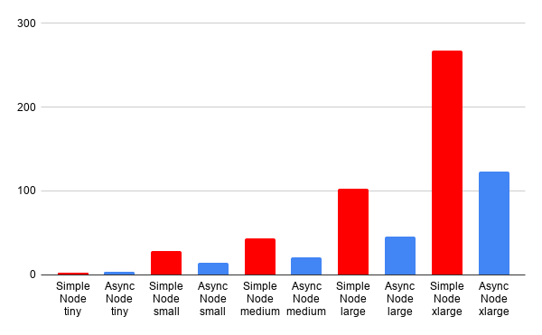
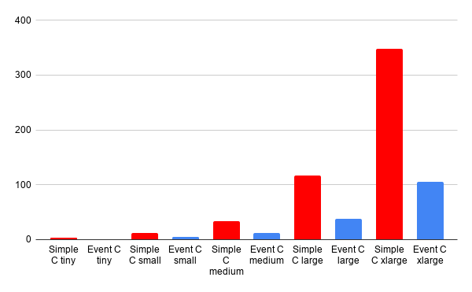
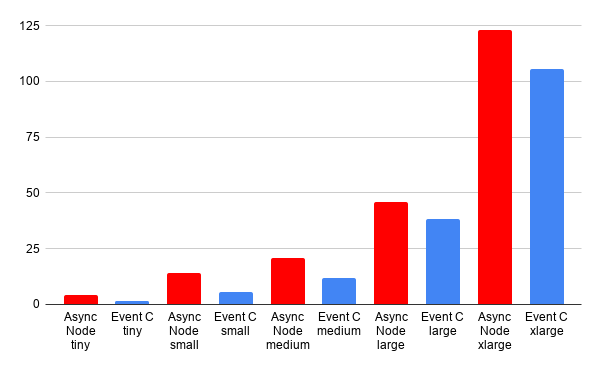
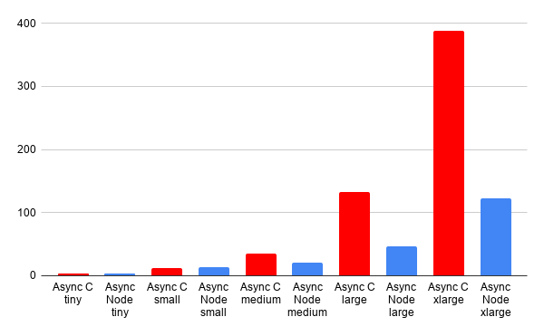

In the last blog series I made reference to a [presentation](https://www.youtube.com/watch?v=EeYvFl7li9E) from Ryan Dahl on NodeJS and wanted to explore the concepts in that talk more. It can be easy to dismiss Javascript as a low performance language based on the observation that it is a single threaded environment. However this talk directly opposes that mindset. Instead it suggests the the real problem is getting I/O out of the hot path. Data locality is almost always the problem. Generally speaking even the slowest arithmatic operations like divide, cosine, and sine are significantly faster than reading from RAM. Reading from disk and network are orders of magnitude slower than reading from RAM. The key argument is if you keep a single loop completely saturated while pushing blocking IO out of the hot path you can get better performance at a reduced memory cost. This is because threading comes at a performance cost. For starters each thread comes with its own memory. At a minium every thread has its own stack which is easily 1 megabyte or more of memory required. Also once you have shared memory between threads you have mutexes and complicated logic that can create worse problems than single threaded code. 

Thinking about this a bit more I decided it might be fun to try out building out a simple event loop on a contained problem to better understand this space.

## Doing some research

Before I got too into this I wanted to get a better understading of what was under the hood of NodeJS. Going into this I knew that NodeJS was largely a C++ project with [V8](https://v8.dev/) bindings. However I was a bit less familar with the machinery it used to handle its non-blocking IO. Doing a bit of research I found that modern NodeJS uses [uvlib](https://libuv.org/) to handle this. This library handles everything from file access and child processes to sockets and DNS resolution. This struck me as a little bit odd. In the original talk I referenced Ryan talked about using [libev](https://software.schmorp.de/pkg/libev.html) to handle eventing. In an attempt to figure out what happened I started digging. Looked into that library I found that it was related to yet another eventing library [libevent](https://libevent.org/). Each library building their own unique features to allow for better performance in event loops. As it turns out Ryan Dahl even [wrote](https://tinyclouds.org/iocp-links/) about all of these libraries and how they came to create libuv.

In many of these libraries the key differentiation revolves around the OS support they have and what APIs they build on. Many point to the difference between [select](https://libevent.org/), [poll](https://man7.org/linux/man-pages/man2/poll.2.html), and [epoll](https://man7.org/linux/man-pages/man7/epoll.7.html). Each giving different performance benefits along the way. Since many of these optimizations operate at the boundary between userland and the kernal it can be quite difficult to create a multi-plaform, performant and coherent API.

## Setting up an experiment

While most of the literature on these eventing libraries had focused on sockets I was a bit more preoccupied with file access. I was still stuck on the original code a made that brough this all up, forcing a synchronous call on file access in NodeJS. Unfortunatly this was the one case where not all kernals provided good non-blocking IO APIs. Because of this utilizing things like epoll didn't fit naturally into this problem. However, there was still a way to move forward with building an event loop and taking the blocking IO off of the hot path.

### Building up the scenario

Before I could do anything I had to set something up to test file access. I decided it would be easy to test reading JavaScript files, and doing some very basic parsing. Each file would have a collection of imports, a handful of constants, and some functions. The processing code would count the total constants and functions found across all files and follow the imports.

Doing some basic research I found that a reasonable range of files for a project would be around 10 or so files for a smaller project and closer to 1000 for a larger project. Since I didn't want to manually create that many files I decided the best way to get this experiment setup would be to write a node program to generate these files. I wanted imports but I also didn't want any circlar references. I assumed circular references could lead to complications during processing. To avoid cicular references I pulled out [Targan's algorithm](https://en.wikipedia.org/wiki/Tarjan%27s_strongly_connected_components_algorithm) to make sure no circular references got generated. Also to make it easier to parse I parsed the graph at the very end I referenced all roots in an index.js.

Also to entertain myself created a list of predefined words to be used in the generation of files and variables. This lead to funny file names like `help-overwhelming-random.js`, `malware-darwin.js`, and `sqs-agentic-wheel-tokenizer.js`. 

### Figuring out what to test

Armed with the ability to create Javascript projects I now needed to decide what to test. Part of my interest was comparing the performance of different cases across NodeJS and C. This resulted in the following applications being created.

* A NodeJS application that blocked on IO by using the sync APIs.
* A NodeJS application that used the async libraries correctly.
* A C application that blocked on IO.
* A C application that used an event loop.

Also since projects could be of different sizes I decided each one of these would be tested against a handful of different projects.

* A tiny project with 10 files.
* A small project with 50 files.
* A medium project with 100 files.
* A large project with 500 files.
* A extra large project with 1500 files.

With all of these I would gather timings and compare how they did relative to each other.

### Benchmarking file access is tricky

Before I go into the specifics of each example I want to preface with a little benchmarking tidbit. While I was conducting this experiment I realized that I was getting some crazy outliers in my initial testing. Those that are closer to the OS and file based performance will know where I am going with this. OS's know that file access is slow and attempt to compensate for this. In some cases quite agressively. In my case I would see a massive boost on the second run of a program. In the case of these tests I was running on a Macbook using and M3 chip. The best way I could find to get the lowest variance in these tests was to `sudo purge` between each run. 

I also was a bit concerned about how specialized the M series architecture was so I did another round of tests on a Linux based machine. This also had similar caching that needed to be cleared between each run.

I would say take the exact numbers with a grain of salk and look more at the trend more so than the result.

## Running the test

Each of these programs had required a bit of different effort. Admittedly I hadn't written much C in the past 15 years so it took me a while to get back into the swing of things.

### Blocking NodeJS example

This was the easiest one to write. I didn't want to do a full JavaScript parse for any implementation. The problem set was very well contained so I just needed to write something that worked. I abused that to its fullest. So instead of pulling out a proper parser, building an AST and travesting the tree I did a simple line by line check. The original form of this used a regular expression to get the import file path but I ended up scrapping it. I didn't like the Regex differences between JavaScript and C and didn't want this to be a comparision of Regex processing engines.

This program can be found [here](https://github.com/JeffreyRiggle/event-queue-testing/blob/main/simple-node/index.js). The most important part is that I used a while loop to do the processing

```Javascript
while (filesToProcess.length > 0) {
  let file = filesToProcess.pop();
  // Do processing
}
```

This took suprizingly little time to write and even at the largest scale it was a faily quick program. The slowest execution time for 1500 files was ~273ms on Mac and ~363 on Linux.

### Async Node example

Moving on I implemented the callback compatible version of the same program to see the difference of just using the event loop properly. The biggest change I had to make was around that while loop. Now instead of blocking each file I would block on batches of files as I found them.

```Javascript
async function main() {
  while (filesToProcess.length > 0) {
    let fileRequests = [];
    for (let file of filesToProcess) {
      fileRequests.push(processFile(file));
    }

    await Promise.all(fileRequests);
  }
}
```

This program can be found [here](https://github.com/JeffreyRiggle/event-queue-testing/blob/main/async-node/index.js).

The resulting difference in performance was notable. In basically all but the tiny dataset the program ran nearly twice as fast. The slowest observed time being ~124ms on Mac and ~278ms on Linux.

### Basic C example

This is where things started to slow down a bit. Since it had been so long since I had written C it took me way to long to get back into it. Eventually I produced a working program. Again I used the similar loop as seen before.

```c
  while (FILES_TO_PROCESS[FILE_TO_PROCESS_INDEX] != NULL)
  {
    processFile(FILES_TO_PROCESS[FILE_TO_PROCESS_INDEX]);
    FILE_TO_PROCESS_INDEX++;
  }
```

The program can be found [here](https://github.com/JeffreyRiggle/event-queue-testing/blob/main/simple-c/main.c).

Unfortunately due to the inefficient array scanning used in this program execution slow down at larger scales. This had performance as bad as ~350ms on Mac and ~363ms on Linux.

### Eventing C example

This one required a bit of work. Originally I just tried putting some threads on the problem without building a legible abstraction. The main execution was done on a single thread but the way file memory was managed some terrible performance was created due to the inefficiencies of the threading and mutexes required. In the end I scrapped that [implemenation](https://github.com/JeffreyRiggle/event-queue-testing/blob/main/async-c/main.c). Eventually I got to a much more [stable version](https://github.com/JeffreyRiggle/event-queue-testing/blob/main/event-c/main.c) that had a proper dynamically sizing thread pool and predicable event loop. Now as I mentioned before the file APIs provided are a bit akward so its not a perfect event loop. In this case the implementation looks more like a managed thread pool to read files and an event loop that dispatches work to the thread pool while doing all of the processing work on a single thread in a loop.

The main event loop ended up being similar to this.

```c
void run(EventLoop* loop)
{
  while (loop->completed == 0)
  {
    // grow pool to maxium if
    if (threadPool->size < MAX_POOL_SIZE)
    {
        // Calculate idle time.

        if (idleTime > GROW_THRESHOLD)
        {
            GrowPool(threadPool, 1);
        }
    }
    
    // dispatch events
    if (loop->lastDispatchedEvent < loop->nextEvent)
    {
        // Find and dipatch pending read file events to idle threads.
    }

    for (int i = 0; i < threadPool->size; i++)
    {
        // Determine if thread has valid result
        if (isValid)
        {
            // Invoke file handler on a single main thread
            loop->handler(loop, threadPool->readers[i]->buffer, threadPool->readers[i]->fileSize);
            
            // Reset thread state
        }
    }
  }
}
```

In the end this version produced the fasted results with the slowest result being ~113ms on Mac and ~195ms on Linux. Similar to the other C example since I didn't use an efficient array search algorithm this could likely be faster.

## Considering the results

With all the runs completed it was time to look at the results and see how things turned out. First the original hypothesis of NodeJS should tell us that using the async APIs over the sync APIs should produce a meaningful difference.



In this chart we can see the difference between the sync node implementation (red) and async node implementation (blue). At the smallest scale the difference is negligable but at the larger scales the difference is notable. The real benefit with the async pattern is distributing the wait time for file IO. This means the performance benefit scales with the amount of files that need to be read and we can see that clearly in this example.

Now if we compare the same in the C implementations we see a similar pattern. Even though we are only using one thread for all of the processing we are still getting the same performance benefits we see in Node.



Conventional wisdom states that lower level languages are faster so lets take a look at how the C implementation fairs against the Node implementation.



What we will notice is that the C implementation is consistently faster. However, these differences are not nearly as significat as one might expect. If we consider this workload more deeply a majority of required time complexity comes from reading from the file system. This problem is not directly owned by either language. The time to load a file is largely dictated by the kernal. Now where things can get interesting and where some of the benefit lies is that C gives you direct control over memory. In the C implementation I was able to get just a bit more performance by being clever with my memory allocations.

Lastly let's consider the cost of getting things wrong. Remember how I mentioned the original C abstraction I created wasn't working well? If we compare this to the Node example we can see that a poor implementation in C is quite detrimental.



In this case the results clearly show that if you are misusing allocations and creating additional thread contention on shared data you are going to run into performance problems. Just because you have access to lower level primitives doesn't mean you are by default faster. If you are not careful you have more ways to slow yourself down.

If you would like to look at the data and draw your own conclusions you can find the data [here](./EventTimingData.csv).

## What I learned from this experiment

In this project I got to have a lot of fun learning about the lower level of event loops. I also got to see first hand how building something in an event loop correctly can produce much better results. While writing C again was a bit of a learning curve I was reminded just how much fun it is for me to think about lower level details like memory allocations and pointers. However it was also a reminder that just because something is written in a low level language doesn't mean it will be fast. It is all to easy to write a low level program that runs way slower than a high level language because you didn't think about the low level primitives correctly. In the next blog we will see that in action all over again.