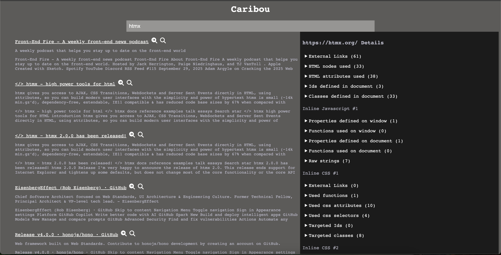

# Visualizing the web

So now we come to the end of our planned journey. If you have been following along so far, here is a quick recap. What started off as a plan to work on a small project in Neovim ended with me doing all sorts of extra work. I have covered how I built a web crawler, an administrative application, and a PageRank implementation. With this done, we can explore the final visualization work I did.

For this final stage, I created a standard search-based UI and another that was more interactive with visualizations.

## Basic search

As a test, I pulled back out Rust and HTMX to build out a basic search page. This is a very simplified version of what you might have seen from Google, Yahoo!, or Bing. However, I decided to do one thing a bit differently. In this search page, I added some extra details.

### With an inspection twist

While working with a crawler, I found that how pages connect to other pages and assets became an interest of mine. Due to this, I added a feature to see all links in a sidebar for a given page.

Another feature that I decided to create was an inspection of the page. I was already downloading all the HTML, JavaScript, and CSS, so I figured it would be neat to see what I could get from those assets. 

For CSS, I got all the links I could find in the documents. Then I decided to list all of the classes, ids, and selectors used. I also decided to find all CSS functions that had been used.

In the case of JavaScript, I decided to look for all properties and functions that had been used on the window and document. I also decided to gather every string that was defined because those strings can contain URLs.

For HTML files, I started by grabbing all links. Then I pulled in all node types, attributes, ids, and classes used. Finally, I processed all inline JavaScript and CSS using the rules above.

This work did require a bit of additional parsing in Rust. My prior experience with [ASTs](https://en.wikipedia.org/wiki/Abstract_syntax_tree) and [visitor patterns](https://en.wikipedia.org/wiki/Visitor_pattern) made this relatively easy to pick up on.

## Interactive search

For the interactive search feature, I decided I would try something rather different. Originally, I wanted to create a large graph of all of the pages and their connections. However, I also really wanted to show how PageRank impacts the importance of pages. I didn't really think that would highlight the importance as much as I wanted. After some consideration, I landed on a visualization that was a collection of stars. Each star was the result of a search, and each star would have a size relative to its page rank. 

Soon after I got that working, I decided to do a couple of screen transitions. When you clicked on a star, you could explore the star. Exploring the star would switch to a different view. This exploration would show the search result as the center of a solar system. This solar system would contain all of the pages it linked to. On that page, you could either follow a planet and see its links, or you could explore the planet. If you explored the planet, you would see all of the assets the page used and the relative footprint of the asset on the page. For example, if a page had 10 images, each 10KB in size, and one JavaScript file 1MB in size, you would see 11 elements with the JavaScript one being larger than the others.

### Tooling for visualization

While I kept the Rust backend, I completely dropped HTMX from the equation. Instead, I did all of this visualization by drawing on a 2d canvas. Now, when I say I drew to a 2d canvas, I mean I did this only using the native browser API with no library on top of it. I decided to forego the use of any build step for this page. Instead, I just used the ESM import style of the document. I found it very nice to have the benefit of multiple JavaScript files and ESM import styles without needing a build step or any JavaScript libraries.

### Building on canvas is different

When you start drawing directly on a canvas and building interactive features manually after doing typical web development, you start to see things other developers already know. I am sure most developers working on games, browsers, or operating systems already know everything I found in far better than I do.

#### Elements and Controls are an abstraction

You don't need HTML elements or common controls for interactivity. While you get benefits like accessibility for using the DOM correctly, you don't actually need a button element to make a button. Instead, you could draw a rectangle and put some text in the center. Then you can watch the mouse events and determine if the mouse is hovering over an element or pressing an element. In these cases, you can just draw a different state in the button.

#### Behaviors require consideration

I alluded to this before, but handling a hover or a click requires careful consideration of the current mouse position and state. The more complex the shape gets, the harder it is to determine if the mouse is within the element. Concepts that seem simple, like word wrapping or truncation, require careful measuring of the text and the size of its container. Most web developers take all of this for granted. You can easily apply CSS rules and not even think twice about what needs to be done to make a hover event trigger correctly on both a square and circular button.

#### Trigonometry is everywhere

While it could have been my application of the canvas, I found that I was constantly having to write code that required trigonometry. I kept finding cases where I would have to plot some visualization along some arc. I would constantly find myself pulling out trigonometry to create certain visualization effects.

After spending so much time doing traditional web development, it is easy to forget just how much math is done in the layers of abstraction you are building on.

### Reflecting on the process

I found this to be radically different from what I had been doing for so long and had a blast doing it. However, I never quite accomplished the effect I was after. One aspect of this was that I didn't really have good images for the stars or the planets. I think with some better images or spritesheets I could produce a much better effect. I also didn't really consider adding the aspect of a camera with a viewpoint. I think adding this element would have allowed for some more interesting searching experiences when looking at some of the scenes.

That being said, while I had a lot of fun doing it, I doubt I would ever use a canvas for a commercial-grade project. While I learned a lot, using semantic HTML has benefits. The most notable being accessibility. I do not even begin to pretend to know how you could make a site that only uses a canvas usable for someone who couldn't see.

## And so it ends

If you have read this blog and all the blogs before it, thank you. While I doubt I have provided any additional insights for anyone who may have read this, I found that some of what I was doing was a touch out of the norm. I had a lot of fun doing this, but there are other interests I have wanted to explore for some time now. 

Forgive me for a moment while I get on my soapbox. I have not explicitly stated this up to now, but I would like to emphasize a choice I made during this project. During this project, I limited my use of AI to general research and as a springboard to more official documentation. I find that while using AI for your day job is a great idea, to truly learn new things it is beneficial to go back to the basics and avoid letting AI do everything for you. I would definitely encourage others who are writing code to learn new concepts and to be very pragmatic about the use of AI.

I do not know how long this project will be hosted; as such, I will finish by providing some images in case I take down the site due to cost, lack of interest, or something else.

**Basic Search**

**Interactive Search**
