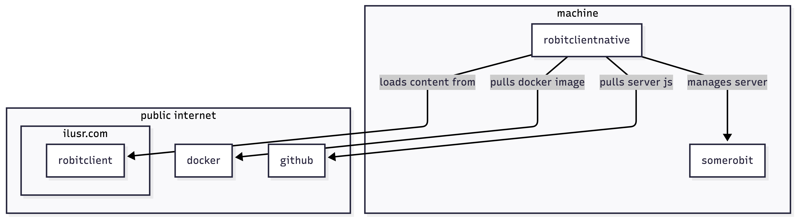

## Building for someone else

Continuing the thread of past projects in creation order we arive at robit. Robit was never anything I took to seriously and yet somehow it ended up being another multi-repo application that was barely used. This started as some projects do, someone in passing was unhappy with [discord's](https://discord.com/) feature set. The problem they had was they wanted to setup scheduled daily messages. I did no research at the time to know if that feature is part of the application. However, given the size of the community I would be surpized if this wasn't a standard feature by now.

## So then why build it?

I had nothing to gain from this work. I was not and still am not a daily discord user. On top of that, while I did give information on how to run this application to the person who started it all, I don't know that it was ever used. I certainly didn't ask for any payment for it.

So what did I have to gain from this? I interested in learning how to build with [Electron](https://www.electronjs.org/) and this felt like a perfect excuse. Since the core focus was on learning, I decided to take the path of least resistance on everything else.

## Setting up the project

By this point I was quite proficient and JavaScript so I decided all of the code would be JavaScript. Creating the server in Java or C# would have been possible but I found that it was way faster to boostrap and prototype with JavaScript. Because of this, I landed on building a Node.js server.

The architecure I ended up creating was the following.

On the server machine, which in this case was a random computer I owned, there was the [electron application](https://ilusr.com/robitclientnative/). That communicated with my personal domain to access the [static assets](https://ilusr.com/robit/). Now depending on if you viewed the web page in the browser or on the electron app you would get a different experience.

If you viewed the site on a browser you would just get the UI to build a config JSON file that you could provide to the server directly.

However, if you used the electron application you would get that experience plus the ability to start the robit server directly either by spawning a node process or by starting a docker container. 

## The typical scope expansion

Once again the scope expanded far beyond what I needed. The original goal was just learn electron and build a discord bot that could send scheduled messages. By the time I was done I had gone over the top on features again. In this case I had build a bot that had three types of communication with eight different configurable actions and a access control system to top it off.

Of course knowing me the scope creep was not just in features. This project resurfaced the problem of having too many run options. While it was more constained than in the past, having the option to run in a local node process or in docker was more than was required.

## Getting back into this project

Before getting back into this project I wasn't sure how I would feel about it. As I have mentioned before I like to run these applications again before writing on them. There are a couple of things that struck me with this one in particular. First, I am not a discord user so just remembering how the application worked was a bit of a challenge. This featured issues like: "what email did I register my account under again?", "How do I create a private server again?", and who can forget "How has the bot permission model changed over the last 6 years?"

Once all those questions had been answered, I had to get the application working again. All repositories in question hadn't been updated since node 10 was LTS. Six years is also an eternety in JavaScript to the tooling landscape had of course changed. This began the drudgery of upgrading every Node version to be compatible with LTS, fixing all of the project dependencies, and dropping yarn.

## Not everything needs to be maintained

As I reflect on this project as a whole, it's clear I learned a fair amount about Electron and discord. However, upon returning to this project what was once interesting had become a chore. Because, I am not a frequent discord user, it is hard for me to form a strong attachment to this project. Having projects to learn a new tool or framework is incredibly valuable, but maintaining those project after they have provided the desired learning is a recipe for discontentment. Sometimes keeping a project as a static asset locked in time is for the best. If it wasn't for this blog series, I would agree that treating robit more like an ancient artifact to be observed and not touched would have been for the best.

Now that I endured some pain and disatisfaction the real fun can begin. What I have been enjoying with these blogs is seeing what I can learn from my past projects. Now that I have done the drudgery I can get on to the fun. In the next blog I am going to explore the build out of the Node.js server. 